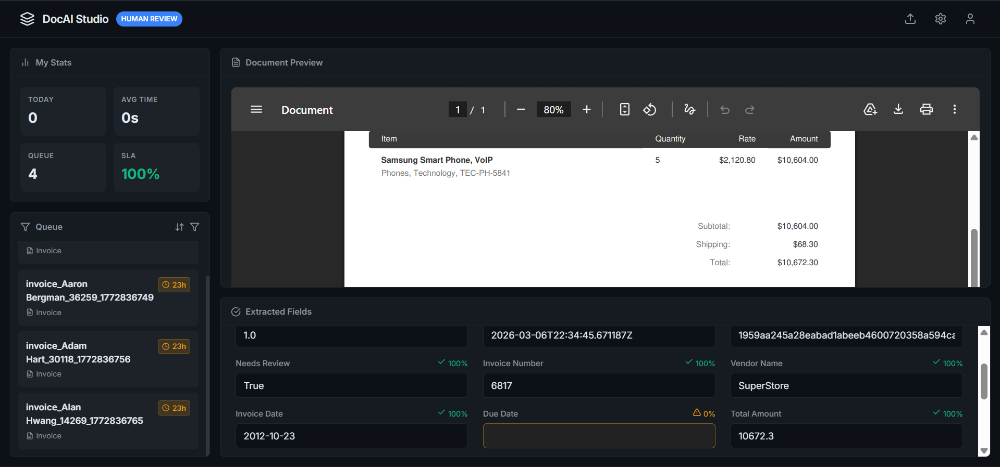
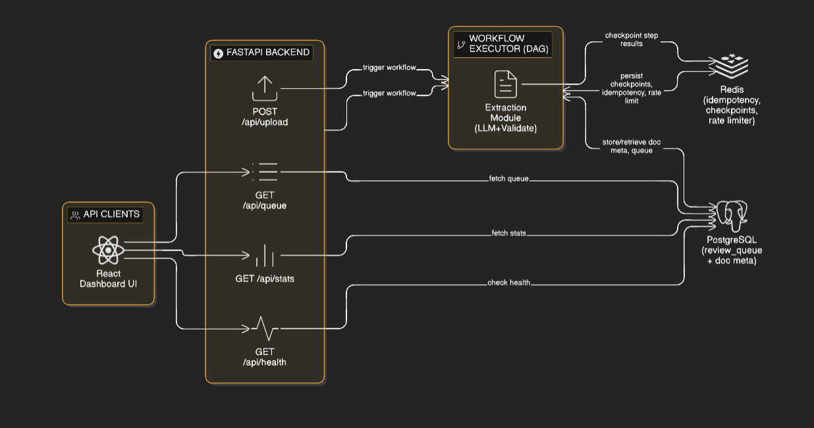

# Document Processing Pipeline

An AI-powered, production-grade document processing platform designed to extract structured financial data from raw documents at scale — targeting **5,000 documents/hour** peak throughput.

---

## Table of Contents

- [Overview](#overview)
- [Architecture](#architecture)
- [Project Structure](#project-structure)
- [Prerequisites](#prerequisites)
- [Environment Variables](#environment-variables)
- [Setup & Installation](#setup--installation)
- [Running the Services](#running-the-services)
- [API Reference](#api-reference)
- [Testing](#testing)
- [Configuration](#configuration)
- [SLA Definitions](#sla-definitions)
- [Design Docs](#design-docs)

---

## Overview

This pipeline takes raw PDF or document payloads, runs them through an LLM-powered extraction engine (backed by [Groq](https://groq.com/)), validates the extracted financial fields, routes low-confidence results to a human review queue, and produces dual-format output (JSON + Parquet). A React-based review dashboard lets human operators audit and correct extracted data.




Key capabilities:

- **Idempotent processing** — SHA-256 content-addressed deduplication (Redis-backed, in-memory fallback)
- **DAG workflow engine** — parallel branch execution, cycle detection, conditional routing, fan-out/fan-in
- **Human-in-the-loop** — atomic claim/release queue with SLA-aware priority ordering and correction feedback loop
- **Dual output** — atomic JSON + Parquet (Snappy) writes via temp-file rename strategy (zero data loss)
- **Field-level locking** — `HUMAN`-sourced corrections are never overwritten by future AI re-runs
- **Full audit trail** — every field change and state transition is timestamped and stored
- **SLA monitoring** — real-time alert evaluation with configurable thresholds
- **Circuit breaker + retry** — exponential backoff with full jitter; sliding-window circuit breaker for LLM/OCR APIs

---
<!-- suggested placement -->


## Architecture

```
┌───────────────────────────────────────────────────────────────────┐
│                        FastAPI Backend (src/api.py)               │
│  POST /api/upload  →  Background PDF parse  →  Workflow Executor  │
│  GET /api/queue    →  Review Queue Manager                        │
│  GET /api/stats    →  SLA Monitor                                 │
│  GET /api/health   →  System Health                               │
└───────────┬───────────────────────────────────────────────────────┘
            │
            ▼
┌───────────────────────┐       ┌──────────────────────────────┐
│  WorkflowExecutor     │       │  ExtractionModule            │
│  (DAG engine)         │──────▶│  (LLM extract + validate)    │
│  src/workflow_executor│       │  src/extraction_module.py    │
│  .py                  │       └──────────────────────────────┘
└───────────┬───────────┘
            │
    ┌───────▼────────┐     ┌─────────────────────┐
    │  PostgreSQL DB │     │  Redis               │
    │  (review_queue │     │  (idempotency store, │
    │   + doc meta)  │     │   checkpoints,       │
    └────────────────┘     │   rate limiter)      │
                           └─────────────────────┘

┌───────────────────────────────────────────┐
│  React Dashboard UI  (ui/)                │
│  Vite + TypeScript + React 18             │
│  Runs on http://localhost:5173            │
└───────────────────────────────────────────┘
```

### Component Breakdown

| Module | File | Responsibility |
|---|---|---|
| **Extraction Module** | `src/extraction_module.py` | LLM extraction, idempotency, state machine, dual output, audit trail |
| **Workflow Executor** | `src/workflow_executor.py` | DAG construction, parallel execution, rate limiting, checkpoints |
| **Review Queue** | `src/review_queue.py` | Atomic claim/release, SLA priority ordering, correction submission |
| **Monitoring** | `src/monitoring.py` | Real-time SLA evaluation, alert triggering |
| **Infrastructure** | `src/infrastructure.py` | Redis + PostgreSQL connection setup, SQLAlchemy ORM models |
| **API** | `src/api.py` | FastAPI routes for queue, upload, stats, health |
| **Dashboard UI** | `ui/src/App.tsx` | React review dashboard with inline field editing |

### Processing Pipeline Stages

```
[Ingest] → [Idempotency Check] → [QUEUED] → [PROCESSING]
    → [LLM Extract + Retry] → [Field Preservation] → [Validation]
    → [Confidence Routing] → [Quality Metrics] → [Dual Output Write]
    → [COMPLETED | REVIEW_PENDING | FAILED]
```

### Document Status Lifecycle

```
QUEUED ──▶ PROCESSING ──▶ COMPLETED
                │
                ├──▶ REVIEW_PENDING ──▶ (human corrects) ──▶ COMPLETED
                │
                └──▶ FAILED
```

### DAG Workflow (Invoice Pipeline)

```
         ┌─────────┐
         │  parse  │  (validate payload, fingerprint)
         └────┬────┘
              │
         ┌────▼────┐
         │ extract │  (LLM extraction via ExtractionModule)
         └────┬────┘
              │
         ┌────▼────┐
         │ enrich  │  (vendor lookup, currency normalisation)
         └────┬────┘
     ┌────────┴────────┐
     ▼                 ▼
┌─────────┐   ┌──────────────────┐
│ publish │   │ publish_for_rev- │
│(direct) │   │ iew (queue)      │
└─────────┘   └──────────────────┘
```

---

## Project Structure

```
document-processing-pipeline/
├── src/
│   ├── api.py                  # FastAPI application & routes
│   ├── extraction_module.py    # Core LLM extraction engine
│   ├── workflow_executor.py    # DAG workflow engine
│   ├── review_queue.py         # Human review queue manager
│   ├── monitoring.py           # SLA monitoring & alerting
│   └── infrastructure.py       # Redis + PostgreSQL setup & ORM models
├── ui/                         # React review dashboard
│   ├── src/
│   │   ├── App.tsx             # Main dashboard component
│   │   └── main.tsx
│   ├── package.json
│   └── vite.config.ts
├── configs/
│   ├── extraction_module_schema.yaml  # Field schema & validation rules
│   ├── sla_definitions.yaml           # SLA thresholds & alert config
│   └── dashboard_spec.yaml            # Grafana-compatible dashboard spec
├── docs/
│   ├── module_architecture.md         # Detailed extraction module design
│   ├── workflow_engine_design.md      # DAG engine + parallelism model
│   ├── review_queue_design.md         # Queue data model & API design
│   ├── monitoring_runbook.md          # Alert runbook & troubleshooting
│   └── operational_assessment.md      # End-to-end operational review
├── tests/
│   ├── unit/test_extraction.py        # Extraction module unit tests
│   ├── integration/test_workflow.py   # Workflow executor integration tests
│   ├── performance/test_performance.py # Throughput & latency tests
│   ├── quality/test_data_quality.py   # Output quality & schema tests
│   └── ui/test_ui.py                  # UI/API contract tests
├── output/
│   ├── json/                   # Processed document JSON outputs
│   └── parquet/                # Processed document Parquet outputs
├── uploads/                    # Uploaded PDFs pending processing
├── sample_data/                # Sample documents & UI stub data
├── requirements.txt
└── conftest.py
```

---

## Prerequisites

- Python 3.10+
- Node.js 18+
- PostgreSQL (default port `5431`)
- Redis (default port `6379`)
- A [Groq API key](https://console.groq.com/) for LLM extraction

---

## Environment Variables

Create a `.env` file at the project root:

```env
# Groq LLM
GROQ_API_KEY=your_groq_api_key_here

# PostgreSQL
POSTGRES_HOST=localhost
POSTGRES_PORT=5431
POSTGRES_USER=postgres
POSTGRES_PASSWORD=your_password
POSTGRES_DB=postgres

# Redis
REDIS_HOST=localhost
REDIS_PORT=6379
REDIS_DB=0
REDIS_PASSWORD=          # leave blank if no auth
```

> If Redis is unavailable, the system falls back to an in-memory idempotency store automatically.
> If PostgreSQL is unavailable, the review queue manager disables gracefully.

---

## Setup & Installation

### Backend

```bash
# Create and activate a virtual environment
python -m venv .venv
.venv\Scripts\activate        # Windows
# source .venv/bin/activate   # macOS/Linux

# Install dependencies
pip install -r requirements.txt
```

### Frontend

```bash
cd ui
npm install
```

---

## Running the Services

### 1. Start the FastAPI Backend

```bash
uvicorn src.api:app --host 127.0.0.1 --port 8000 --log-level info
```

The API will be available at `http://127.0.0.1:8000`.  
Interactive docs: `http://127.0.0.1:8000/docs`

### 2. Start the React Dashboard

```bash
cd ui
npm run dev
```

The dashboard will be available at `http://localhost:5173`.

---

## API Reference

| Method | Endpoint | Description |
|---|---|---|
| `GET` | `/api/queue` | List pending review items (supports `?limit=` and `?offset=`) |
| `POST` | `/api/queue/{id}/claim` | Atomically claim an item for review |
| `POST` | `/api/queue/{id}/release` | Release a claimed item back to PENDING |
| `POST` | `/api/queue/{id}/submit` | Submit corrections and mark COMPLETED or REJECTED |
| `GET` | `/api/stats` | Queue statistics and SLA breach metrics |
| `GET` | `/api/health` | System health status and active alert count |
| `POST` | `/api/upload` | Upload a PDF for end-to-end extraction and queueing |
| `GET` | `/api/documents/{id}` | Retrieve a processed document PDF for preview |

---

## Testing

```bash
# Run the full test suite
pytest tests/

# Run a specific suite
pytest tests/unit/
pytest tests/integration/
pytest tests/performance/
pytest tests/quality/
pytest tests/ui/
```

The test suite covers:

| Suite | File | Coverage |
|---|---|---|
| Unit | `tests/unit/test_extraction.py` | Idempotency, state machine, field locking, circuit breaker, retry logic |
| Integration | `tests/integration/test_workflow.py` | End-to-end DAG execution, parallel branches, conditional routing |
| Performance | `tests/performance/test_performance.py` | Throughput benchmarks (≥ 4,500 docs/hr target) |
| Quality | `tests/quality/test_data_quality.py` | Output schema validation, confidence scoring |
| UI | `tests/ui/test_ui.py` | API contract tests for the dashboard endpoints |

---

## Configuration

### Field Schema (`configs/extraction_module_schema.yaml`)

Defines the extracted fields, their types, validation rules, confidence thresholds, and whether human corrections should be preserved across reprocessing.

Supported document types: `invoice`, `contract`, `receipt`, `po`

Extracted financial fields include: `invoice_number`, `vendor_name`, `invoice_date`, `due_date`, `currency`, `subtotal`, `tax_amount`, `total_amount`, and more.

### Dashboard Spec (`configs/dashboard_spec.yaml`)

Grafana-compatible panel specifications for production monitoring dashboards.

---

## SLA Definitions

Defined in `configs/sla_definitions.yaml` and enforced in real-time by `src/monitoring.py`:

| Metric | Threshold | Severity | Window |
|---|---|---|---|
| P95 processing latency | < 30 seconds | Critical | 5 min |
| Throughput | > 4,500 docs/hour | Warning | 15 min |
| Error rate | < 1% | Critical | 5 min |
| Review queue depth | < 500 items | Warning | 5 min |
| SLA breach rate | < 0.1% | Critical | 1 hour |

Alerts are evaluated on every `record_metrics()` call and deduplicated using an active-alert key set to prevent alert floods.

---

## Design Docs

Detailed design documents are in the `docs/` folder:

| Document | Description |
|---|---|
| [module_architecture.md](docs/module_architecture.md) | Extraction module interface, idempotency strategy, error handling, scalability design |
| [workflow_engine_design.md](docs/workflow_engine_design.md) | DAG structure, parallelism model, rate limiting, fan-out/fan-in semantics |
| [review_queue_design.md](docs/review_queue_design.md) | Queue data model, atomic claim logic, feedback loop to training corpus |
| [monitoring_runbook.md](docs/monitoring_runbook.md) | Alert runbook with troubleshooting steps for each SLA breach scenario |
